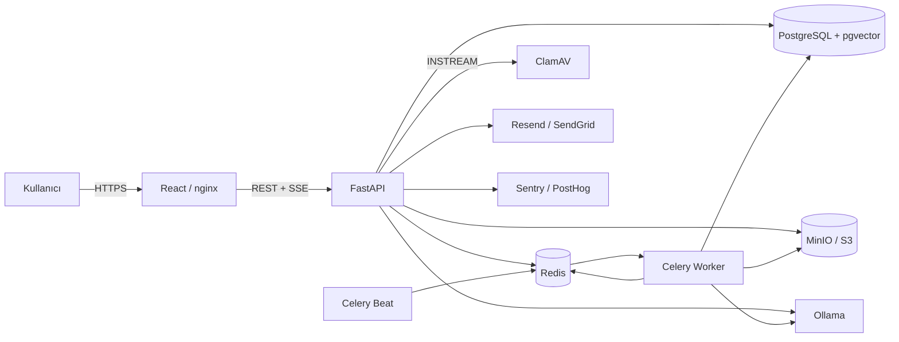
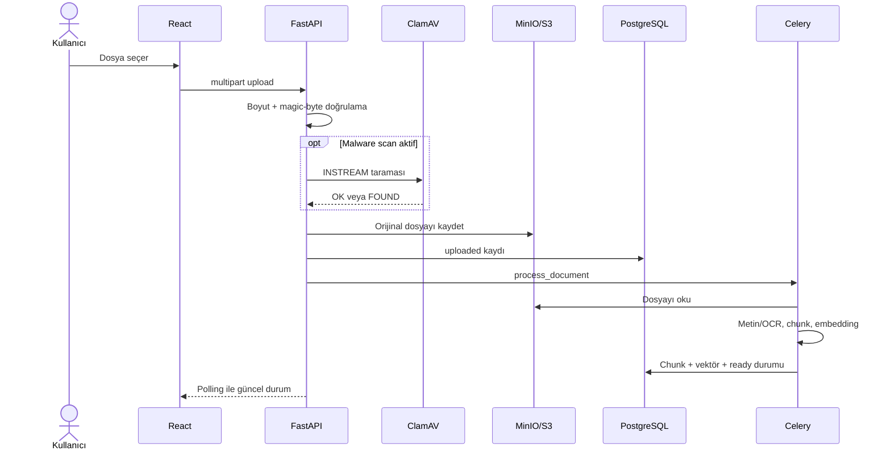
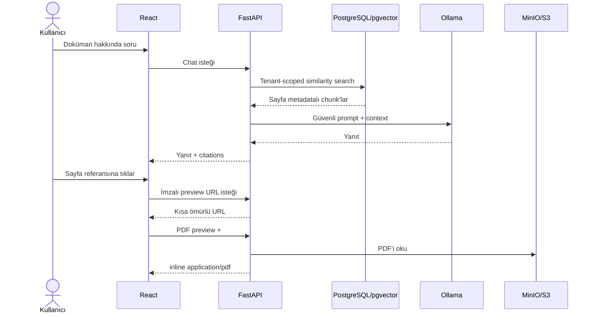

# DocAssistant Mimarisi

Bu belge güncel çalışma zamanı topolojisini ve kritik doküman/AI akışlarını gösterir.

## Deployment

ClamAV yerel ortamda `security`, Ollama ise `ai` Docker Compose profiliyle
etkinleştirilir. Production ortamında aynı arayüzler yönetilen PostgreSQL, Redis ve
S3 servislerine yönlendirilebilir.

## Doküman Yükleme ve İşleme

Tarama etkin olduğunda ClamAV zaman aşımı veya bağlantı hatası yüklemeyi durdurur;
tarama yapılmamış dosya depoya yazılmaz.

## RAG Chat ve Sayfa Referansı

