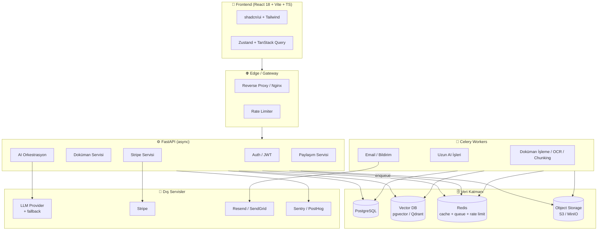
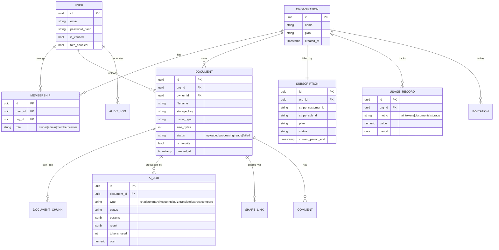

# DocAssistant — Proje Planı

> AI destekli, çok kiracılı (multi-tenant) doküman asistanı SaaS uygulaması.
> Bu belge; kapsam, mimari, teknoloji seçimleri, veri modeli, güvenlik, test ve
> faz bazlı yol haritasını tanımlar. Ayrıca ilk istekte **olmayan ama kritik**
> maddeleri işaretler (bkz. [Bölüm 4](#4-kritik-eksikler--öneriler-yeni-eklenenler)).

---

## 1. Proje Özeti & Hedefler

| Konu | Değer |
|------|-------|
| Ürün | Dokümanları yükleyip 7 farklı AI işlemiyle (chat, özet, quiz vb.) işleyen SaaS |
| Kullanıcı tipi | Bireysel kullanıcı + ekip/organizasyon (B2B & B2C) |
| İş modeli | Abonelik (Free / Pro / Business) — Stripe |
| Çekirdek değer | RAG ile "dokümanla konuşma", sayfa referanslı güvenilir yanıtlar |
| Kalite hedefi | Güvenli, izole (tenant), ölçeklenebilir, gözlemlenebilir |

**Başarı kriterleri (ilk sürüm için):**
- Doküman yükleme → işleme → sorgulama akışı uçtan uca çalışır.
- Tenant izolasyonu her sorguda garanti altında (sızıntı = 0).
- AI maliyeti kullanıcı bazında izlenir ve kotayla sınırlanır.
- Ödeme ve abonelik yaşam döngüsü (upgrade/downgrade/cancel) sorunsuz.

---

## 2. Mimari Genel Bakış



**Neden bu şekil?**
- Uzun AI işleri (özet, quiz, çeviri, ingest) HTTP isteğini bloklamamalı → **Celery**.
- RAG için embedding + arama ayrı bir vector store gerektirir.
- Dosyalar DB'de değil, **object storage**'da tutulmalı (imzalı URL ile erişim).

---

## 3. Teknoloji Yığını (Onaylanan)

| Katman | Teknoloji |
|--------|-----------|
| Backend | FastAPI, async SQLAlchemy 2.0, Pydantic v2 |
| DB | PostgreSQL 16, Alembic (migration) |
| Vektör | **Öneri: pgvector veya Qdrant** (ChromaDB yerine — bkz. 4.3) |
| RAG | LangChain |
| Cache/Queue | Redis, Celery |
| Frontend | React 18, TypeScript, Vite, Tailwind, shadcn/ui |
| FE State | Zustand, TanStack Query, React Hook Form + Zod |
| Ödeme | Stripe |
| Email | Resend veya SendGrid |
| Gözlem | Sentry, PostHog, yapılandırılmış JSON log |
| Konteyner | Docker, docker-compose, GitHub Actions |

---

## 4. Kritik Eksikler / Öneriler (YENİ — eklenenler)

> İlk istek listesinde **olmayan** ama production için **kritik** gördüğüm maddeler.
> Öncelik: 🔴 zorunlu · 🟡 önemli · 🟢 iyi olur.

### Altyapı & Veri
- 🔴 **4.1 Object Storage (S3 / MinIO):** Dosyalar nerede fiziksel olarak tutulacak belirsiz. DB'ye BLOB koymak ölçeklenmez. Yerelde MinIO, production'da S3 uyumlu depolama. İmzalı URL zaten listede var, bunun altyapısı bu.
- 🔴 **4.2 LLM Provider seçimi + soyutlama + fallback:** "AI" deniyor ama sağlayıcı (OpenAI / Anthropic / Azure OpenAI / yerel) belirtilmemiş. Bir `LLMProvider` arayüzü + birincil/yedek sağlayıcı + timeout/retry gerekir. Sağlayıcı kesintisi tüm ürünü durdurmasın.
- 🟡 **4.3 Vector DB tercihi:** ChromaDB prototipte iyi ama production'da ölçekleme/kalıcılık/backup zayıf. Zaten Postgres olduğu için **pgvector** (operasyon basitliği) veya yük artarsa **Qdrant** öneriyorum.
- 🔴 **4.4 AI maliyet & token takibi:** Kota "istek sayısı" değil **token/maliyet** bazlı olmalı. İşlem öncesi token tahmini + tenant bazlı aylık maliyet tavanı + aşımda durdurma. Aksi halde bir kullanıcı faturayı patlatır.
- 🟡 **4.5 RAG işleme boru hattı detayı:** Chunking stratejisi, embedding modeli, sayfa/koordinat eşleme, tekrar-eden içerik (dedup), yeniden-embed (re-index) tetikleri netleştirilmeli. Sayfa referanslı yanıt buna bağlı.
- 🟡 **4.6 AI sonuç önbellekleme:** Aynı doküman + aynı istek için sonuç cache'lenerek maliyet düşürülür (Redis / DB).

### Güvenlik & Uyumluluk
- 🔴 **4.7 Stripe webhook idempotency + reconciliation:** Webhook'lar tekrar gelebilir; idempotency key + event log + periyodik durum eşitleme (reconcile) şart.
- 🔴 **4.8 Yasal sayfalar:** Kullanım Şartları (ToS), Gizlilik Politikası, Çerez onayı. GDPR ve Stripe onboarding için zorunlu.
- 🟡 **4.9 AI çıktı moderasyonu + PII maskeleme:** Prompt injection listede var; ek olarak zararlı çıktı filtreleme ve dokümandaki kişisel verinin log'a sızmaması gerekir.
- 🟡 **4.10 Email deliverability (SPF/DKIM/DMARC):** Doğrulama/şifre-sıfırlama mailleri spam'e düşmesin diye domain kimlik doğrulaması.
- 🟢 **4.11 Secrets yönetimi:** `.env` yeterli değil; production'da gizli anahtarlar için vault/secret manager.

### Ürün & Kullanıcı Deneyimi
- 🔴 **4.12 Test stratejisi:** Listede test yok. pytest (backend), Vitest + React Testing Library (FE), Playwright (E2E), yük testi (k6/Locust). CI'ya bağlanmalı.
- 🟡 **4.13 Streaming yanıt (SSE/WebSocket):** Chat cevabı token token akmalı; yoksa UX zayıf olur.
- 🟡 **4.14 Onboarding + boş durum (empty state) + landing page:** İlk kullanıcı deneyimi ve pazarlama sayfası.
- 🟡 **4.15 i18n (TR/EN):** Arayüz çok dilli olacak mı? Baştan altyapısı kurulmalı.
- 🟢 **4.16 Erişilebilirlik (a11y):** shadcn temeli iyi; klavye/aria kontrolleri hedeflensin.
- 🟢 **4.17 PWA / mobil uyum:** Responsive + opsiyonel PWA.

### Operasyon
- 🔴 **4.18 Yedekleme & felaket kurtarma:** Postgres + vector store + object storage için otomatik yedek ve geri-yükleme testi.
- 🟡 **4.19 API versiyonlama:** `/api/v1/...` baştan.
- 🟡 **4.20 Gözlemlenebilirlik (metrics/tracing):** Sentry hata için iyi; ek olarak OpenTelemetry + Prometheus/Grafana metrikleri + uptime/health-check izleme.
- 🟡 **4.21 Staging ortamı + feature flags:** Prod öncesi test ortamı ve kademeli özellik açma.
- 🟢 **4.22 Soft delete + veri saklama politikası + audit log değişmezliği (immutability):** "Right to be forgotten" ile uyumlu saklama süreleri.
- 🟢 **4.23 Idempotency (genel):** Batch upload ve AI tetiklemede çift işlemi önlemek için idempotency key.

---

## 5. Veri Modeli (Ana Varlıklar)



**Tenant izolasyonu kuralı:** Her sorguda `org_id` (ve gerektiğinde `user_id`)
filtresi zorunlu. Bunu tek noktadan garanti etmek için repository katmanında
**otomatik tenant scoping** (SQLAlchemy event / dependency) kullanılacak.

---

## 6. Modül Bazlı Kapsam

| # | Modül | Kapsam özeti |
|---|-------|--------------|
| M1 | Auth & Kullanıcı | Register/login, JWT + refresh rotation, email doğrulama, şifre sıfırlama, 2FA (TOTP/Pro), zxcvbn, account lockout |
| M2 | Multi-tenant | Organization/Workspace, 4 rol, davet/yönetim, tenant scoping |
| M3 | Doküman Yönetimi | Yükleme (PDF/DOCX/XLSX/PPTX/TXT/MD/resim-OCR), magic-bytes doğrulama, boyut limiti, batch upload, liste/sil/favori, object storage |
| M4 | İşleme Boru Hattı | Metin çıkarma, OCR, chunking, embedding, vector index, sayfa eşleme (Celery) |
| M5 | AI Özellikleri | Chat (RAG), Summary (4 seviye), Key Points, Quiz, Translation, Data Extraction, Compare |
| M6 | Ödeme | Stripe 3 plan, upgrade/downgrade/cancel, webhook, kota/tier |
| M7 | Dashboard & Analytics | Kullanım grafikleri (Recharts), kota takibi, admin panel |
| M8 | Paylaşım & İşbirliği | Shareable links, ekip paylaşımı, history, yorum/not |
| M9 | Export & Templates | PDF/DOCX/XLSX/MD export, prompt şablonları (hukuk/akademik/iş) |
| M10 | Güvenlik | Rate limit, XSS/CSRF/SQLi, prompt injection, malware scan, signed URL, audit log, GDPR, AES-256 at-rest |
| M11 | Bildirim | Transactional email, in-app notification |
| M12 | DevOps & Gözlem | Docker, CI/CD, Sentry, PostHog, JSON log, health check, backup |
| M13 | Dokümantasyon | Swagger/OpenAPI, mimari diyagramlar, README, `.env.example` |

---

## 7. Geliştirme Fazları / Yol Haritası

> Her faz kendi içinde çalışır bir dilim (vertical slice) üretir; sonda demo edilebilir.

### Faz 0 — Temel & İskele
- Monorepo yapısı (`backend/`, `frontend/`, `infra/`, `docs/`)
- Docker-compose (Postgres, Redis, MinIO, backend, frontend, worker)
- Alembic kurulumu, temel config, `.env.example`
- CI iskeleti (lint + test + build), pre-commit hooks
- **Kritik ekler:** 4.19 API versiyonlama, 4.12 test iskeleti

### Faz 1 — Auth & Multi-tenant (M1, M2)
- Kullanıcı, organizasyon, membership modelleri
- JWT + refresh rotation, email doğrulama, şifre sıfırlama, lockout
- Tenant scoping altyapısı, rol tabanlı yetki (RBAC)
- 2FA (Pro'ya bağlı feature flag)

### Faz 2 — Doküman Yönetimi & İşleme (M3, M4)
- Object storage entegrasyonu (MinIO/S3) + signed URL
- Yükleme + magic-bytes doğrulama + boyut limiti + malware scan
- Batch upload, liste/sil/favori
- Celery işleme: metin/OCR → chunk → embedding → vector index
- **Kritik ekler:** 4.1, 4.5

### Faz 3 — AI Çekirdeği: RAG Chat (M5 kısmi)
- LLM provider soyutlama + fallback (4.2)
- RAG chat, sayfa referanslı yanıt, SSE streaming (4.13)
- Prompt injection önleme + çıktı moderasyonu (4.9)
- Token/maliyet takibi + kota kontrolü (4.4)

### Faz 4 — Diğer AI Özellikleri (M5 kalan)
- Summary (4 seviye), Key Points, Quiz, Translation, Data Extraction, Compare
- AI sonuç önbellekleme (4.6)
- Prompt şablonları (M9 kısmi)

### Faz 5 — Ödeme & Kota (M6)
- Stripe planları, checkout, portal
- Webhook + idempotency + reconciliation (4.7)
- Tier bazlı kota zorlama

### Faz 6 — Dashboard, Paylaşım, Export (M7, M8, M9)
- Recharts dashboard, admin panel
- Shareable links, ekip paylaşımı, history, yorum
- Export (PDF/DOCX/XLSX/MD)

### Faz 7 — Sertleştirme & Yayına Hazırlık (M10, M11, M12, M13)
- Güvenlik denetimi, GDPR (data export / silme), audit log
- Bildirimler (email + in-app), email domain auth (4.10)
- Gözlemlenebilirlik (4.20), yedekleme (4.18), staging (4.21)
- Yasal sayfalar (4.8), i18n (4.15), onboarding (4.14)
- Yük testi, dokümantasyon, deployment guide

---

## 8. Güvenlik & Uyumluluk Kontrol Listesi

- [ ] Tüm sorgularda tenant scoping (otomatik + testli)
- [ ] Endpoint bazlı rate limiting (Redis)
- [ ] Girdi doğrulama (Pydantic) + çıktı encode (XSS)
- [ ] CSRF koruması (cookie tabanlı akış için)
- [ ] Parametreli sorgular (SQLi) — ORM zorunlu
- [ ] Prompt injection guard + AI çıktı moderasyonu
- [ ] Dosya magic-bytes + boyut + malware scan
- [ ] Signed URL (kısa ömürlü) ile indirme
- [ ] Audit log (kim/ne/ne zaman) — değişmez
- [ ] AES-256 at-rest (dosya + hassas alanlar), TLS in-transit
- [ ] GDPR: veri dışa aktarma + "unutulma hakkı"
- [ ] Secrets vault / güvenli env yönetimi

---

## 9. Test Stratejisi

| Seviye | Araç | Kapsam |
|--------|------|--------|
| Unit | pytest, Vitest | Servis/util/hook mantığı |
| Integration | pytest + testcontainers | DB, Redis, storage, Stripe mock |
| Contract | schemathesis | OpenAPI şema uyumu |
| E2E | Playwright | Kritik kullanıcı akışları |
| Yük | k6 / Locust | Yükleme + AI eşzamanlılığı |
| Güvenlik | Bandit, npm audit, ZAP | Statik + dinamik tarama |

Hedef: kritik yollarda anlamlı kapsama + CI'da zorunlu geçiş.

---

## 10. Ortamlar & DevOps

- **local:** docker-compose (tüm bağımlılıklar dahil)
- **staging:** prod'a yakın, gerçek Stripe test modu
- **production:** yönetilen Postgres + Redis + S3 + konteyner orkestrasyonu
- CI/CD: GitHub Actions (lint → test → build → image → deploy)
- Gözlem: Sentry (hata), PostHog (ürün analitiği), Prometheus/Grafana (metrik), health checks

---

## 11. Önerilen Klasör Yapısı

```
DocAssistant/
├── backend/
│   ├── app/
│   │   ├── api/v1/            # router'lar
│   │   ├── core/             # config, security, logging
│   │   ├── models/           # SQLAlchemy
│   │   ├── schemas/          # Pydantic
│   │   ├── services/         # iş mantığı
│   │   ├── ai/               # provider soyutlama, RAG, prompt'lar
│   │   ├── workers/          # Celery task'ları
│   │   └── repositories/     # tenant-scoped erişim
│   ├── alembic/
│   └── tests/
├── frontend/
│   ├── src/
│   │   ├── components/ (ui/)
│   │   ├── features/
│   │   ├── hooks/  lib/  stores/
│   │   └── routes/
│   └── tests/
├── infra/
│   ├── docker/               # Dockerfile'lar (multi-stage)
│   └── docker-compose.yml
├── docs/
└── .github/workflows/
```

---

## 12. Başlıca Riskler

| Risk | Etki | Azaltma |
|------|------|---------|
| AI maliyet patlaması | Yüksek | Token tahmini + tenant kota tavanı + cache (4.4, 4.6) |
| Tenant veri sızıntısı | Kritik | Otomatik scoping + izolasyon testleri |
| LLM sağlayıcı kesintisi | Yüksek | Fallback provider + retry/timeout (4.2) |
| Uzun AI işlerinde timeout | Orta | Celery + streaming + iş durumu takibi |
| Vector store ölçekleme | Orta | pgvector/Qdrant seçimi (4.3) |
| Stripe webhook tutarsızlığı | Yüksek | Idempotency + reconciliation (4.7) |

---

## 13. Sonraki Adım (Onay Bekleyen Kararlar)

Kod yazımına başlamadan netleşmesi gereken seçimler:
1. **LLM sağlayıcı** hangisi olacak? (OpenAI / Anthropic / Azure / yerel)
2. **Vector DB:** pgvector mı Qdrant mı? (öneri: başla pgvector)
3. **Object storage:** local MinIO + prod S3 uygun mu?
4. **i18n:** Sadece TR mi, TR+EN mi?
5. **Kota birimi:** İstek sayısı mı, token/maliyet mi? (öneri: token/maliyet)

> Bu 5 karar verildiğinde Faz 0 iskelesini kurmaya başlayabilirim.
